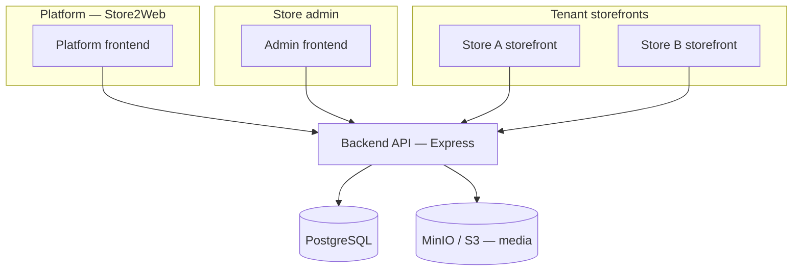

# Architecture

## High-level system



## Repository layout

```
store2web/
├── backend/          Express API, Drizzle ORM, migrations
├── frontend/         React + Vite (platform, admin, storefront — TBD split)
├── docs/             Project documentation
├── docker-compose.yml
└── README.md
```

## Tech stack (current)

| Layer | Technology |
|-------|------------|
| API | Node.js, Express 5, TypeScript |
| Database | PostgreSQL 16, Drizzle ORM |
| Object storage | MinIO (S3-compatible) for product/media assets |
| Frontend | React 19, Vite 8, TypeScript |
| Dev environment | Docker Compose |

## Backend layering

Follow a **service-layer** design (see `.github/copilot-instructions.md`):

```
routes → controllers → services → repositories (Drizzle queries)
```

| Layer | Responsibility |
|-------|----------------|
| **Routes** | HTTP method, path, middleware wiring |
| **Controllers** | Request/response mapping, status codes |
| **Services** | Business logic, tenant checks, validation |
| **Repositories** | Database access only |

Rules:

- No DB queries in controllers.
- No HTTP objects in services.
- All tenant-scoped reads/writes must enforce `tenantId` in the service layer.

## Frontend direction (planned)

Three logical surfaces may share one Vite app initially or split later:

| Surface | URL pattern (example) | Purpose |
|---------|-------------------------|---------|
| **Platform** | `store2web.com` | Marketing, register, login |
| **Admin** | `app.store2web.com` or `/admin` | Store management |
| **Storefront** | `{slug}.store2web.com` | Public customer site |

Routing and host-based tenant resolution are documented in [Multi-tenancy](./multi-tenancy.md).

## API conventions

- Base path: `/api`
- JSON request/response bodies
- Health: `GET /api/health`
- Future auth: session or JWT (TBD); all mutating store routes require authenticated owner + tenant membership
- Public storefront reads: unauthenticated, tenant resolved from host or path slug

## Infrastructure (local)

Docker Compose services:

| Service | Port | Role |
|---------|------|------|
| backend | 3000 | API |
| frontend | 5173 | Dev UI |
| postgres | 5432 | Primary database |
| minio | 9000 / 9001 | S3 API / console |

## Cross-cutting concerns (planned)

| Concern | Approach |
|---------|----------|
| Auth | TBD — email/password first |
| File uploads | Presigned URLs to S3/MinIO |
| Validation | Zod or similar at API boundary |
| Logging | Existing request logger middleware |
| Errors | Central error handler; typed API errors |
| Migrations | Drizzle Kit; additive, reviewed before merge |
