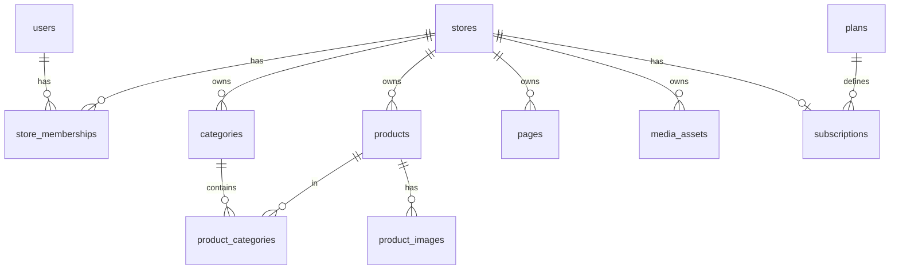

# Data model

Direction for PostgreSQL schema via Drizzle ORM. Table names are illustrative; adjust during implementation.

## Current schema (implemented)

| Table | Notes |
|-------|-------|
| `users` | `id`, `name`, `email`, `created_at` — placeholder only; no auth yet |

## Planned core entities

### Platform & auth

| Table | Key fields | Notes |
|-------|------------|-------|
| `users` | id, email, password_hash, name | Extend existing table |
| `sessions` or refresh tokens | user_id, expires_at | If session-based auth |

### Tenancy

| Table | Key fields | Notes |
|-------|------------|-------|
| `stores` | id, slug, name, description, logo_url, status, created_at | Tenant root |
| `store_memberships` | store_id, user_id, role | Links users to stores |

### Catalog (flexible per business)

| Table | Key fields | Notes |
|-------|------------|-------|
| `categories` | id, store_id, name, slug, parent_id, sort_order | Tree optional |
| `products` | id, store_id, name, slug, description, price, status, metadata jsonb | `metadata` for varying attributes |
| `product_categories` | product_id, category_id | Many-to-many |
| `product_images` | id, product_id, url, sort_order | Or S3 keys only |

Using `jsonb metadata` on products allows different businesses to attach different attribute sets (size, color, SKU fields) without schema churn. Structured filters can be added per store later if needed.

### Content / detail pages

| Table | Key fields | Notes |
|-------|------------|-------|
| `pages` | id, store_id, title, slug, body (markdown/html), type, published, sort_order | About, Contact, custom landing pages |

Page `type` examples: `about`, `contact`, `policy`, `custom`.

### Media

| Table | Key fields | Notes |
|-------|------------|-------|
| `media_assets` | id, store_id, s3_key, mime_type, size, created_at | Shared upload registry |

### Subscriptions (future)

| Table | Key fields | Notes |
|-------|------------|-------|
| `plans` | id, name, limits jsonb | Defined in [Subscriptions](./subscriptions.md) |
| `subscriptions` | store_id, plan_id, status, period_end | Stripe linkage later |

## Entity relationship (planned)

## Status enums (draft)

**Store:** `draft`, `published`, `suspended`

**Product:** `draft`, `published`, `archived`

**Page:** `draft`, `published`

## Migration policy

- Review existing migrations before adding new ones
- Prefer additive changes; document breaking changes in docs
- Generate: `npm run db:generate` / apply: `npm run db:migrate`
