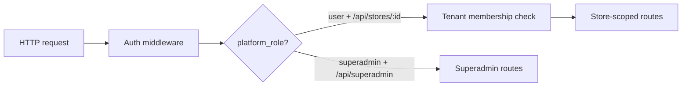

# Superadmin (platform admin)

Store2Web operators need a **superadmin** surface — a platform-level console separate from store owner admin. Superadmins manage the entire SaaS: tenants, users, moderation, and (later) subscriptions — without being members of every store.

## Who is a superadmin?

A **superadmin** is a platform operator (Store2Web staff), not a store owner. They authenticate like any user but carry a **platform role** that grants cross-tenant access.

| Role | Scope | Typical user |
|------|-------|--------------|
| `user` (default) | Own account + stores they belong to | Business owners |
| `superadmin` | Entire platform | Store2Web internal team |

Superadmin is **not** a `store_memberships` role. It lives on the user record (or a dedicated platform-admins table) and applies globally.

## Superadmin vs store admin

| | Store admin | Superadmin |
|---|-------------|------------|
| Scope | One or more stores they belong to | All stores on the platform |
| UI | Store admin dashboard | Platform superadmin console |
| URL (example) | `/admin` or `app.store2web.com` | `/superadmin` or `admin.store2web.com` |
| Sees other tenants | No | Yes |
| Manages platform settings | No | Yes |
| Manages own catalog/pages | Yes | Only when impersonating or direct support (TBD) |

Store owners never see the superadmin console. Superadmins use a distinct layout and navigation so the two surfaces are not confused.

## Core responsibilities

### Tenant (store) management

- List all stores with search/filter (name, slug, status, owner email, created date)
- View store detail: profile, members, product/page counts, subscription (future)
- Change store status: `draft`, `published`, **`suspended`**
- Suspend abusive or non-compliant stores (storefront hidden; owner may still log in — TBD)
- Delete store (soft-delete preferred; hard-delete with confirmation)

### User management

- List platform users with search (email, name)
- View user profile and stores they belong to
- Disable / re-enable user account (blocks login platform-wide)
- Promote/demote platform role (`user` ↔ `superadmin`) — restricted to existing superadmins
- Reset flows (e.g. force password reset) — optional, later

### Platform overview

- Dashboard metrics (MVP placeholders acceptable):
  - Total stores, published vs draft vs suspended
  - Total users
  - New registrations (7 / 30 days)
  - Stores with zero products (onboarding health)
- Activity feed or recent signups list

### Moderation & support (planned)

- Flagged content queue — deferred until reporting exists
- **Impersonation** (“view as store owner”) — deferred; high audit requirements
- Internal notes on a store or user — optional `admin_notes` table

### Subscriptions & billing (future)

- Assign or override plan per store
- View billing status when Stripe is integrated
- See [Subscriptions](./subscriptions.md)

### System & configuration (later)

- Feature flags (enable beta features per store or globally)
- Platform-wide announcements banner
- Email template overrides
- Maintenance mode

## User journeys

### 1. Superadmin login

1. Superadmin logs in via the same auth as store owners (platform login).
2. After auth, if `platform_role = superadmin`, show link or redirect to superadmin console.
3. Non-superadmins hitting `/superadmin` receive 403.

### 2. Suspend a store

1. Superadmin searches store by slug or owner email.
2. Opens store detail, reviews summary.
3. Sets status to `suspended` with optional reason (stored in audit log).
4. Public storefront returns unavailable message; API public routes stop serving that tenant.

### 3. Onboard a new superadmin

1. Existing superadmin opens Users → finds target user (or invites by email — later).
2. Sets platform role to `superadmin`.
3. Action recorded in audit log.

## UI surface (planned)

| Page | Purpose |
|------|---------|
| Dashboard | Platform KPIs, recent activity |
| Stores | Searchable table of all tenants |
| Store detail | Profile, status, members, counts, actions (suspend, delete) |
| Users | Searchable table of all accounts |
| User detail | Profile, memberships, disable, role change |
| Audit log | Filterable list of superadmin actions |
| Settings | Platform config (later) |

**Visual style:** distinct from store admin — e.g. dark sidebar or different accent — so operators always know they are in platform mode.

## API endpoints (planned)

All routes under `/api/superadmin/*`, guarded by superadmin middleware.

| Method | Path | Description |
|--------|------|-------------|
| GET | `/api/superadmin/dashboard` | Aggregate stats |
| GET | `/api/superadmin/stores` | Paginated store list + filters |
| GET | `/api/superadmin/stores/:id` | Store detail + member summary |
| PATCH | `/api/superadmin/stores/:id` | Update status, internal notes |
| DELETE | `/api/superadmin/stores/:id` | Soft-delete store |
| GET | `/api/superadmin/users` | Paginated user list |
| GET | `/api/superadmin/users/:id` | User detail + store memberships |
| PATCH | `/api/superadmin/users/:id` | Disable account, change platform role |
| GET | `/api/superadmin/audit-logs` | Paginated audit entries |

Store-scoped catalog CRUD stays under `/api/stores/:id/*` for owners; superadmin uses platform routes unless impersonation is added later.

## Authorization model

Rules:

1. Superadmin middleware checks `platform_role === 'superadmin'` — not client-supplied headers.
2. Superadmin routes **skip** tenant membership checks but still validate resource IDs.
3. Store admin routes **never** grant cross-tenant access, even if the user is also a superadmin (use superadmin API explicitly).
4. Every mutating superadmin action writes an **audit log** row.

## Data model additions

See [Data model](./data-model.md). Summary:

| Table / field | Purpose |
|---------------|---------|
| `users.platform_role` | `user` (default) or `superadmin` |
| `users.disabled_at` | Null = active; timestamp = login blocked |
| `admin_audit_logs` | Who did what, when, on which resource |

**Audit log fields (draft):** `id`, `actor_user_id`, `action`, `resource_type`, `resource_id`, `metadata jsonb`, `created_at`.

Example actions: `store.suspended`, `store.deleted`, `user.disabled`, `user.role_changed`.

## Security requirements

- [ ] Superadmin routes isolated under `/api/superadmin` with dedicated middleware
- [ ] No elevation via store membership alone
- [ ] Audit log for all mutating superadmin operations
- [ ] Rate-limit and log failed access to superadmin paths
- [ ] Initial superadmin seeded via migration or env bootstrap — not public self-signup
- [ ] Two-factor auth for superadmins — deferred but recommended before production
- [ ] Impersonation requires explicit audit + time limit — if implemented

## Bootstrap (first superadmin)

Public registration must **not** create superadmins. Options:

1. **Seed script** — migration or CLI sets `platform_role` for a known email
2. **Env bootstrap** — `SUPERADMIN_EMAIL` on first deploy only
3. **Manual DB update** — dev only

Document the chosen approach in [Development](./development.md) when implemented.

## Phasing

| Phase | Scope |
|-------|--------|
| **1** | `platform_role`, middleware, seed first superadmin, stores list + suspend |
| **2** | Users list, disable account, audit log |
| **3** | Dashboard metrics, user role promotion UI |
| **4** | Subscription overrides, impersonation, feature flags |

## Open questions

- [ ] Should suspended stores hide admin access for owners or only the public storefront?
- [ ] Soft-delete retention period before purge
- [ ] Separate superadmin login URL vs role-based redirect after normal login
- [ ] Email notifications to owners when store is suspended

Update this doc and [Project status](./project-status.md) when decisions are made.
